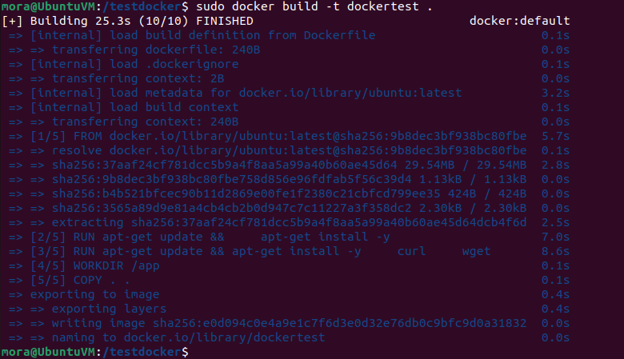
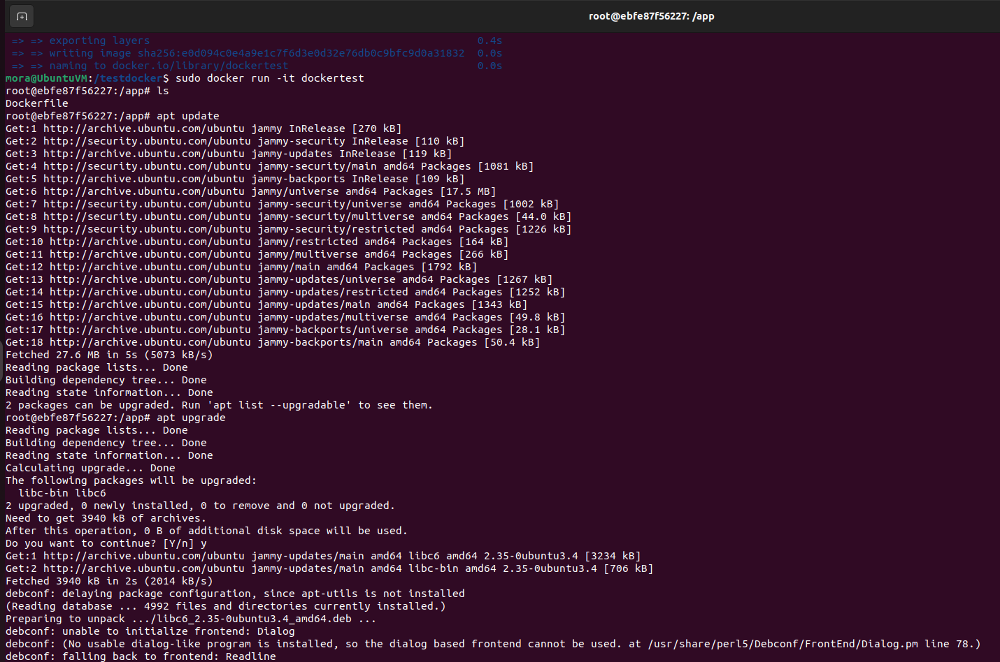

# Контейнеризация (семинары)

## Урок 4. Dockerfile и слои

### **Информация о проекте**

Задание: необходимо создать Dockerfile, основанный на любом образе (вы в праве выбрать самостоятельно).
В него необходимо поместить приложение, написанное на любом известном вам языке программирования (Python, Java, C, С#, C++).
При запуске контейнера должно запускаться самостоятельно написанное приложение.

**Выполнение**

*Подготовила студентка Geek Brains* [**`Эрина Ксения`**](https://github.com/MoraKsu)